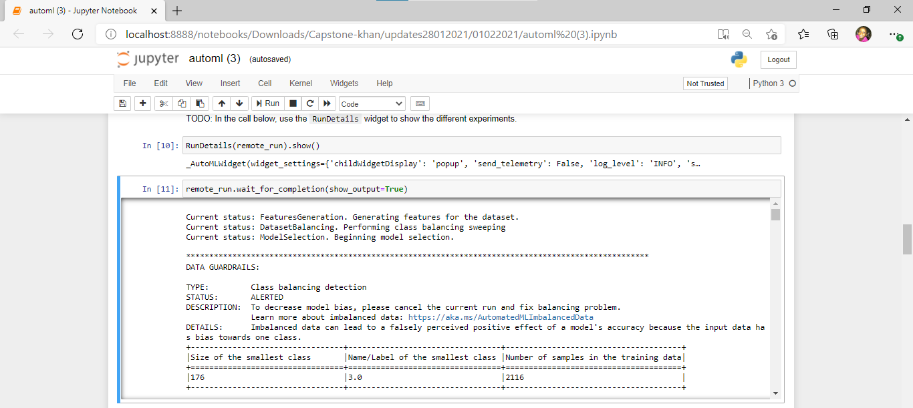
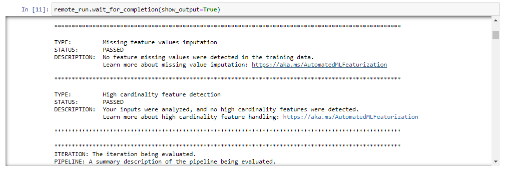
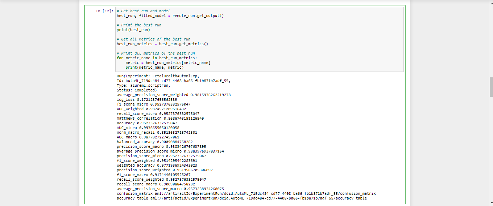
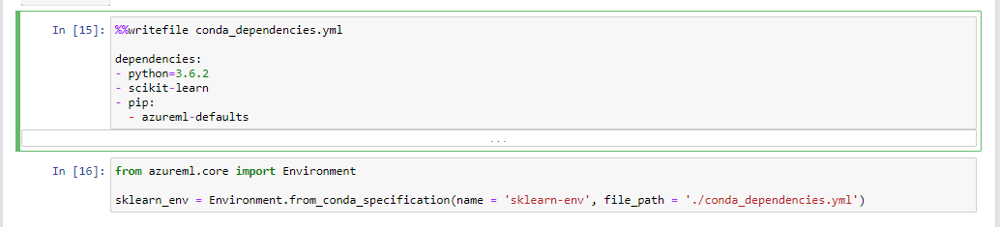
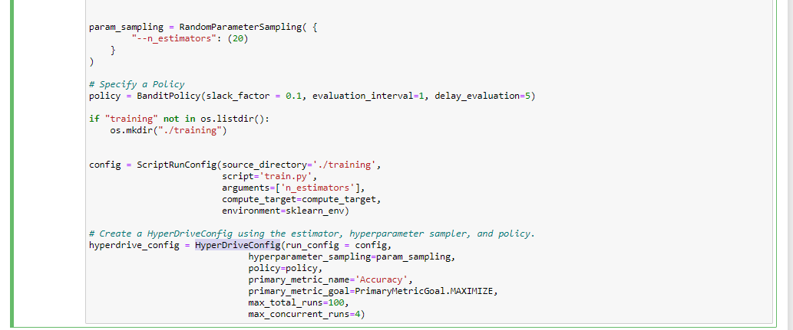

*NOTE:* This file is a template that you can use to create the README for your project. The *TODO* comments below will highlight the information you should be sure to include.

# Capstone Project - Fetal Health Classification

### Overview
The dataset for this project was obtained from kaggle, [Fetal Health Classification](https://www.kaggle.com/andrewmvd/fetal-health-classification). 

The dataset is based on the aim to reduce child mortality which is reflected in several of the United Nations' Sustainable Development Goals and is a key indicator of human progress. The UN expects that by 2030, countries end preventable deaths of newborns and children under 5 years of age, with all countries aiming to reduce under‑5 mortality to at least as low as 25 per 1,000 live births.

Parallel to notion of child mortality is of course maternal mortality, which accounts for 295 000 deaths during and following pregnancy and childbirth (as of 2017). The vast majority of these deaths (94%) occurred in low-resource settings, and most could have been prevented.

The dataset was collected using Cardiotocograms (CTGs) are a simple and cost accessible option to assess fetal health, allowing healthcare professionals to take action in order to prevent child and maternal mortality. The equipment itself works by sending ultrasound pulses and reading its response, thus shedding light on fetal heart rate (FHR), fetal movements, uterine contractions and more.


## Dataset
It contains 2126 records of features extracted from Cardiotocogram exams, which were then classified by three expert obstetritians into 3 classes - Normal,Suspect, Pathological.


### Task
*TODO*: Explain the task you are going to be solving with this dataset and the features you will be using for it.

baseline value - Baseline Fetal Heart Rate (FHR)

accelerations - Number of accelerations per second

fetal_movement - Number of fetal movements per second

uterine_contractions - Number of uterine contractions per second

light_decelerations - Number of LDs per second

severe_decelerations - Number of SDs per second

prolongued_decelerations - Number of PDs per second

abnormal_short_term_variability - Percentage of time with abnormal short term variability

mean_value_of_short_term_variability - Mean value of short term variability

percentage_of_time_with_abnormal_long_term_variability - Percentage of time with abnormal long term variability

mean_value_of_long_term_variability - Mean value of long term variability

histogram_width - Width of the histogram made using all values from a record

histogram_min - Histogram minimum value

histogram_max - Histogram maximum value

histogram_number_of_peaks - Number of peaks in the exam histogram

histogram_number_of_zeroes - Number of zeroes in the exam histogram

histogram_mode - Hist mode

histogram_mean - Hist mean

histogram_median - Hist Median

histogram_variance - Hist variance

histogram_tendency - Histogram trend

fetal_health - Fetal health: 1 - Normal 2 - Suspect 3 - Pathological


### Access
The data set has been downloaded from kaggle and can be accessed via [my github](https://raw.githubusercontent.com/BAderinto/capstone-project/main/fetal_health.csv). The data is read into an Azure Machine Learning TabularDataset by using the following code

```
from azureml.data.dataset_factory import TabularDatasetFactory
ds = TabularDatasetFactory.from_delimited_files("https://raw.githubusercontent.com/BAderinto/capstone-project/main/fetal_health.csv")
```

## Automated ML

THe Automated ML experiment by instantiating an `AutoMLConfig` object as follows:
```
automl_settings = {
    "experiment_timeout_minutes": 20,
    "max_concurrent_iterations": 5,
    "primary_metric" : 'accuracy'
}

automl_config = AutoMLConfig(
        task='classification',
        compute_target=compute_target,
        training_data=train_dataset,
        label_column_name='fetal_health',
        n_cross_validations=5,
        **automl_settings
)
```


## Automated ML

Configuration and settings used for this Capstone Automated ML experiment are further tabulated in the table below:

Configuration | Description | Value
------------- | ----------- | -----
experiment_timeout_minutes | This is used as an exit criteria, it defines how long, in minutes, your experiment should continue to run | 20
max_concurrent_iterations | Represents the maximum number of iterations that would be executed in parallel | 5
primary_metric | The metric that Automated Machine Learning will optimize for model selection | accuracy
task | The type of task to run. Values can be 'classification', 'regression', or 'forecasting' depending on the type of automated ML problem | classification
compute_target | The compute target to run the experiment on | compute_target
training_data | Training data, contains both features and label columns | train_dataset
label_column_name | The name of the label column | fetal_health
n_cross_validations | No. of cross validations to perform | 5 


### Results
*TODO*: What are the results you got with your automated ML model? What were the parameters of the model? How could you have improved it?

*TODO* Remeber to provide screenshots of the `RunDetails` widget as well as a screenshot of the best model trained with it's parameters.

### AutoML Screenshots

**Run Details Widget**





**Best Model**



## Hyperparameter Tuning
*TODO*: What kind of model did you choose for this experiment and why? Give an overview of the types of parameters and their ranges used for the hyperparameter search
For the hyperparameter tuning experiment, `RandomForestClassifier` algorithm from the `sklearn.ensemble` framework in conjuction with hyperDrive was used. The only hyperparameter used for this experiment is `n_estimators`, the number of trees in the forest, which was given the value 20

The conda_dependencies.yml was added to the created environment that contains the scikit-learn library as shown below.



HyperDriveConfig was created using the `ScriptRunConfig` which was created by specifying the training script, compute target and environment, the termination policy, `BanditPolicy` as well as the hyperparameteras shown below. 



### Results
*TODO*: What are the results you got with your model? What were the parameters of the model? How could you have improved it?

*TODO* Remeber to provide screenshots of the `RunDetails` widget as well as a screenshot of the best model trained with it's parameters.

## Model Deployment
*TODO*: Give an overview of the deployed model and instructions on how to query the endpoint with a sample input.

## Screen Recording
[screen recording](https://youtu.be/FLeCelctrKI)

## Standout Suggestions
*TODO (Optional):* This is where you can provide information about any standout suggestions that you have attempted.

## Reference
[sklearn.ensemble.RandomForestClassifier](https://scikit-learn.org/stable/modules/generated/sklearn.ensemble.RandomForestClassifier.html)
